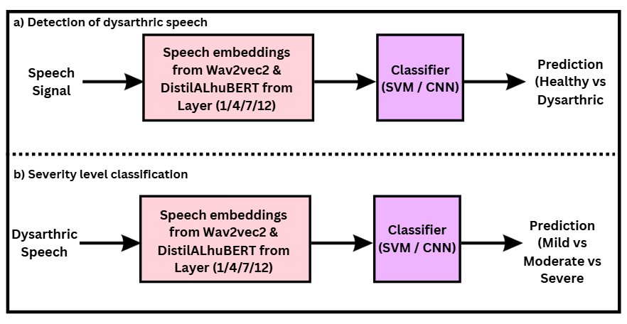

# Multilingual Dysarthria Detection and Severity Classification Using Layer-Wise Embeddings

Accurate and early detection of dysarthria severity from speech can transform clinical workflows, enabling timely, non-invasive interventions for individuals with neuromotor speech disorders. This work investigates the effect of embedding layer depth on classification performance using two self-supervised speech models—Wav2Vec2-BASE and DistilALHuBERT—evaluating them on three datasets: UA-Speech, TORGO, and the Tamil Dysarthric Speech Corpus (TDSC). Our experiments show that embeddings from initial and intermediate layers consistently outperform final-layer embeddings across all tasks and datasets. We present novel findings indicating that intermediate layers, especially Layer 4, capture articulatory features relevant for severity assessment better than final layers, especially in morphologically rich languages like Tamil.

For further details, please refer to our published work on TDSC Dataset: [Link to Paper](https://aclanthology.org/2024.icon-1.74/).

## Schematic Block Diagram



## Datasets

This project uses three publicly available dysarthric speech datasets:

- [**TDSC - Tamil Dysarthric Speech Corpus**](https://asr-ssn.github.io/tdsc/)  
- [**TORGO Database**](https://torgo.ecn.utoronto.ca/)  
- [**UA-Speech Corpus**](https://dialrcs.github.io/ua-speech-corpus/)

---

## ⚙️ Prerequisites

- Python 3.8–3.11  
- [Virtual environment (optional but recommended)]  
- Install required packages from `requirements.txt`:
  ```bash
  python -m venv venv
  source venv/bin/activate   # On Windows use: venv\Scripts\activate
  pip install -r requirements.txt
  ```

---

## 🏃‍♂️ Steps to Run the Project

You can perform feature extraction and classification for both **HuBERT** and **Wav2Vec2** using the same steps:

1. **Prepare your dataset**  
   - Place your dataset (e.g., TDSC, TORGO, or UA-Speech) in a folder containing `.wav` files structured as required.

2. **Adjust paths in the script**  
   - Open your extraction script (e.g., `distilALhubert_extraction.py` for HuBERT, or an equivalent Wav2Vec script).
     
Update the following variables in your extraction and classification scripts so they work correctly with your dataset and environment:

- **Model Checkpoint Path**
  ```python
  model_ckpt_path = "/path/to/your/model_checkpoint.ckpt"
  ```
  Path to your downloaded or trained HuBERT or Wav2Vec2 checkpoint.

- **Input Audio Folder**
  ```python
  input_folder = "/path/to/your/input_audio_dataset"
  ```
  Folder containing your `.wav` files.

- **Output Embeddings Folder**
  ```python
  output_folder = "/path/to/your/output_embeddings"
  ```
  Where the script will save extracted embedding `.pt` files.

- **Processed Audio Structure Folder**
  ```python
  processed_structure_folder = "/path/to/your/processed_audio_structure"
  ```
  Where processed `.wav` files will be moved after embeddings are extracted.

- **Local Data Folder** (optional for faster processing)
  ```python
  local_data_folder = "/path/to/your/local_copy_of_dataset"
  ```
  Folder to store a local copy of your dataset.

- **Example Embedding File for Sanity Check**
  ```python
  pt_file_path = "/path/to/your/embeddings_folder/example_embeddings.pt"
  ```
  Path to a saved embedding you want to inspect for validation.

- **Embeddings Folder for Classification**
  ```python
  embedding_folder = "/path/to/your/embeddings_folder"
  ```
  Folder containing your saved embeddings for running SVM/CNN classifiers.

- **Subfolders for Renaming Files**
  ```python
  subfolder_1 = '/path/to/your/features_folder/severe'
  subfolder_2 = '/path/to/your/features_folder/mild'
  subfolder_3 = '/path/to/your/features_folder/moderate'
  subfolder_M_control = '/path/to/your/features_folder/M_control'
  subfolder_F_control = '/path/to/your/features_folder/F_control'
  ```
  Adjust these subfolders to match your dataset structure if you plan to add suffixes like `_dysarthria` or `_control` during file renaming.

- **Averaging Embeddings Script**
  ```python
  input_folder = '/path/to/your/features_folder'
  output_folder = '/path/to/your/averaged_features_folder'
  ```
  - `input_folder`: folder containing `.pt` embeddings to average.
  - `output_folder`: folder where the averaged `.npy` features will be saved.

> ✅ **Important:** Replace each `/path/to/your/...` with the actual path to your dataset, embeddings, or desired output locations. These modifications are necessary for the scripts to run successfully on your local or cloud environment.


3. **Run the script**  
   Execute your extraction script:
   ```bash
   python distilALhubert_extraction.py
   ```
   or for Wav2Vec2:
   ```bash
   python wav2vec_extraction.py
   ```

4. **Train and evaluate**  
   - After embeddings are saved, use your classifier code (SVM, CNN, etc.) to perform dysarthria detection and severity classification.
   - Adjust paths in the classifier script to point to your embeddings folder.

**Note:** The provided example script [`distilALhubert_extraction.txt`](distilALhubert_extraction.txt) covers the complete pipeline for HuBERT, including model loading, embedding extraction, dataset structure replication, and a sample SVM training process. (Similar Code is followed for Wav2vec2)

## 📊 Evaluation Results

Below are our key performance tables comparing SVM and CNN classifiers across datasets, using both DistilALHuBERT and wav2vec2 models.

### 🔹 Dysarthric Severity Classification with DistilALHuBERT


### 🔹 Dysarthric Severity Classification with wav2vec2


### 🔹 Dysarthric Detection with DistilALHuBERT


### 🔹 Dysarthric Detection with wav2vec2


